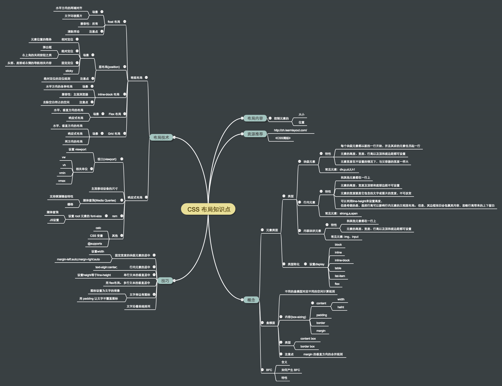
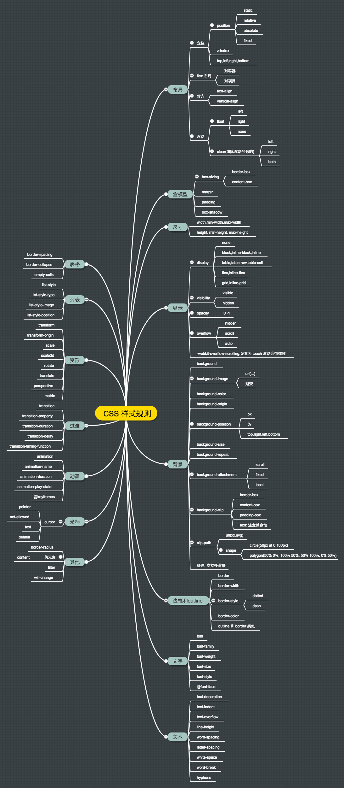

# CSS
## 目录
* [概览](summary/README.md)
* [基础](detail/basic)
  * [CSS 介绍](detail/basic/intro.md)
  * [样式写在哪](detail/basic/place.md)
* [选择器](detail/selector)
* [样式规则](detail/rules)
  * [背景](detail/rules/background)
  * [过渡](detail/rules/transition)
  * [动画](detail/rules/animate)
  * 等等
* [样式规则值的类型](detail/value-type)
* [样式的继承和层叠](detail/inheritance-and-cascade)
  * 继承
  * 层叠
* 布局
  * [布局介绍](detail/layout)
  * [元素类型](detail/layout/detail/elem-type.md)
  * [盒模型](detail/layout/detail/box-model)
  * 布局技术
    * [positon](detail/layout/detail/postion)
    * [~~float~~](detail/layout/detail/float): 只有在文字围绕图片才用。
    * [inline-block](detail/layout/detail/inline-block)
    * 媒体查询(Media Queries)
    * rem，vw 和 vh
    * [Flex](detail/layout/detail/flex)
    * Grid
* 统一浏览器的默认样式
  * 浏览器默认样式
  * reset.css 和 normalize.css
* [浏览器兼容性](detail/compatibility)
* [调试 CSS](detail/debug)
* [最佳实践](best-practice)
* [练习](practice)

## 文档
* [CSS2.1 规范 中文版](http://www.ayqy.net/doc/css2-1/cover.html)

## 概览

